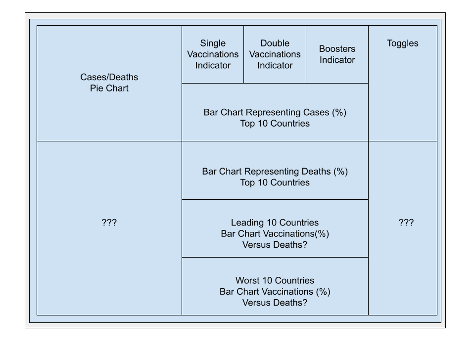

# Covid-19 Dashboard
Preview: https://covid-stat-dashboard.herokuapp.com/

A dashboard showing the current number of Covid-19 Cases, Deaths, Recoveries for the chosen area of the world for the day.

# Dashboard Design Draft
Using [Google Docs Drawing](https://docs.google.com/drawings/), I created a draft design for the dashboard as to get a rough visual on what grid dimensions to use and what data to portray on my dashboard.

# How I made it
Using Plotly, I created various interactive graphs representing country specific Covid-19 data sourced from OWID and ESRI.

Once I'd created a locally working version, I wanted to deploy it so users could interact with the dashboard I made.
https://dash.plotly.com/deployment

# Data Sources

[ESRI All Time Covid Data](https://coronavirus-resources.esri.com/datasets/bbb2e4f589ba40d692fab712ae37b9ac_1/geoservice?geometry=34.182%2C-38.069%2C-16.794%2C63.033&orderBy=Country_Region&selectedAttribute=Confirmed&where=Last_Update%20%3E%3D%20TIMESTAMP%20%272020-02-23%2000%3A00%3A00%27%20AND%20Last_Update%20%3C%3D%20TIMESTAMP%20%272020-04-25%2023%3A59%3A59%27)

[GitHub Covid Data (Daily Updates)](https://github.com/owid/covid-19-data/tree/master/public/data)

